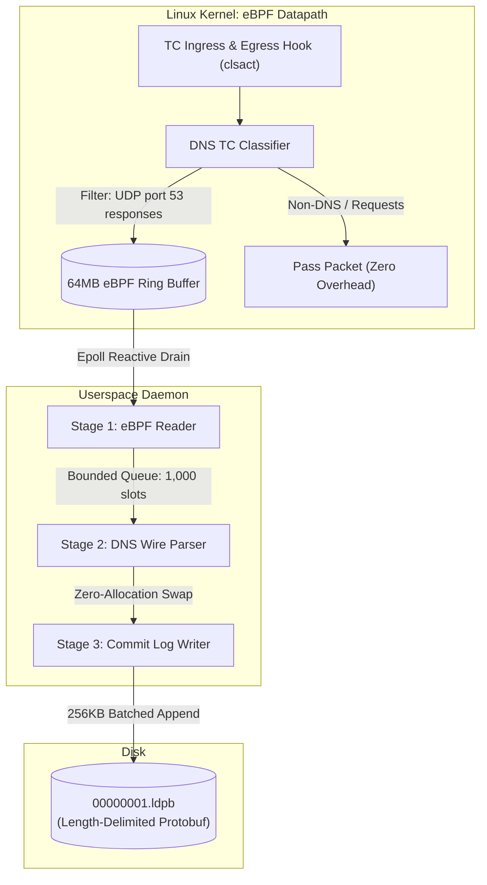

# cilium-mini-rs

eBPF-powered Kubernetes Dataplane V2 & Network Observability Daemon in Rust.

---

## Architecture Overview



For detailed component documentation:

- [eBPF Datapath Architecture](docs/ebpf_architecture.md)
- [Userspace Pipeline Architecture](docs/userspace_architecture.md)

---

## Prerequisites

1. stable rust toolchains: `rustup toolchain install stable`
2. bpf-linker: `cargo install bpf-linker`

## Build & Run

```shell
cargo build

sudo cilium-mini-rs -i lo
```

## License

This project utilizes a split-licensing model, separating the user-space application and the kernel-space eBPF code.

### User-Space

With the exception of the eBPF code, this application is distributed under the terms of the [MIT License].

Unless you explicitly state otherwise, any contribution intentionally submitted for inclusion in this crate by you shall be licensed under the MIT License, without any additional terms or conditions.

### Kernel-Space

All eBPF code is distributed under the terms of either:

- The [GNU General Public License (Version 2)]
- The [MIT License]

_(at your option)._

Unless you explicitly state otherwise, any contribution intentionally submitted for inclusion in this project by you, as defined in the GPL-2.0 license, shall be dual-licensed as above, without any additional terms or conditions.

---

[MIT License]: LICENSE-MIT
[GNU General Public License (Version 2)]: LICENSE-GPL2
