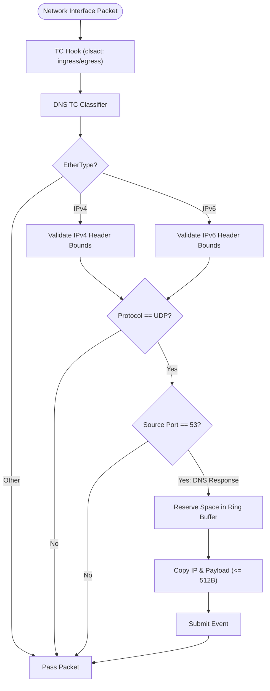

# Cilium Mini: eBPF Datapath Architecture

The eBPF layer of `cilium-mini-rs` provides high-performance, passive DNS observability directly within the Linux kernel network datapath.

---

## Datapath Flow

---

## Key Technical Details

### 1. Hooking & Traffic Control (TC)

- **Attachment**: Attached via the `clsact` qdisc to both **ingress** and **egress** hooks on the target network interface.
- **Passive Monitoring**: Always returns a pass verdict, ensuring network traffic continues unaffected with zero disruption to host or container networking.

### 2. Fast-Path Early Exits

- **Layer Validation**: Progressively validates Ethernet (IPv4/IPv6), IP header bounds, and the UDP transport layer.
- **Response Filtering**: Strictly inspects responses originating from DNS port 53. Requests, TCP traffic, and all other protocols immediately bypass deep packet inspection.

### 3. Memory Layout & Alignment

- **Shared Structures**: Kernel and user-space share a raw IP address representation and a raw DNS event structure.
- **Alignment Invariants**: Data structures are C-compatible and 8-byte aligned to guarantee predictable memory layouts across the kernel boundary.
- **Compiler Optimization**: IP copying is performed via 64-bit unrolled word assignments to eliminate compiler-generated memory copy intrinsics in eBPF bytecode.

### 4. Ring Buffer Transport

- **Capacity**: Sized at **64 MB** (power-of-2 page-aligned) to absorb heavy traffic bursts (~10,000 events/sec for ~10 seconds) without dropping events.
- **Zero-Copy Reservation**: Allocates memory directly within the ring buffer, copies up to 512 bytes of DNS payload using bounded loops for verifier compliance, and submits the event.
- **Latency Tracking**: Captures kernel timestamps to measure eBPF processing duration.
