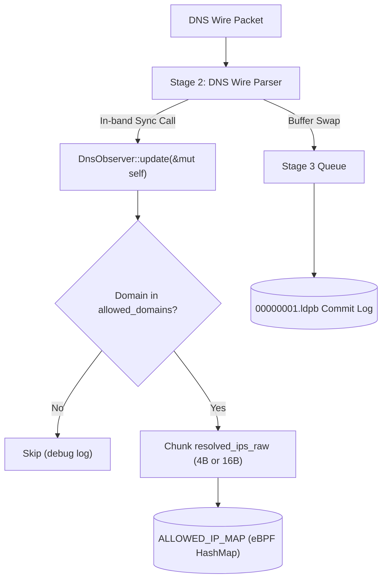

# FQDN Policy Engine & ALLOWED_IP_MAP Architecture

Documentation and design reference for dynamic FQDN network policy enforcement in `cilium-mini-rs`.

---

## 1. Architecture Overview

---

## 2. Zero-Allocation Contiguous Buffer Strategy

To preserve line-rate throughput and eliminate garbage collection pauses, the pipeline avoids nested heap allocations:

- **Flat Framing**: `resolved_ips` (single pre-allocated `String`) and `resolved_ips_raw` (single pre-allocated `Vec<u8>`).
- **Capacity Preservation**: `String::clear()` and `Vec<u8>::clear()` reset lengths to 0 without executing drop handlers or freeing backing memory.
- **Why Not Nested Messages?**: In Rust, nested Protobuf messages (`repeated IpAddrRecord`) drop their inner `String` and `Vec<u8>` on vector truncation, triggering heap fragmentation and `malloc`/`free` cycles.

---

## 3. Multi-IP Resolution & DNS Round-Robin

Modern web services (e.g. `api.github.com`, `leetcode.com`) return multiple `A`/`AAAA` records in the Answer section (`ANCOUNT > 1`):

- **Firewall Hole Prevention**: Kubernetes Pods connect to arbitrary IPs chosen from the DNS response set. If the policy engine only authorizes the first IP, outbound connections to alternate endpoints are dropped.
- **Chunked Insertion**: The observer splits `resolved_ips_raw` into fixed-size slices (`4` bytes for IPv4, `16` bytes for IPv6) and inserts every IP into `ALLOWED_IP_MAP`.

---

## 4. GKE Dataplane V2 Interview Deep Dive

### Q1: Why does Cilium do FQDN policy enforcement via DNS proxy / DNS snooping?
*Traditional iptables / IP-based network policies* cannot easily track dynamic cloud endpoints that change IPs frequently (CDNs, Cloud APIs).
*Cilium Dataplane V2* snoops DNS responses (or intercepts via an embedded CoreDNS proxy), updates an eBPF map (`cilium_policy`), and allows traffic to those specific IPs for that specific pod.

### Q2: How are stale IPs evicted in production?
In production Cilium:
1. Every DNS record has a **TTL (Time To Live)**.
2. An active garbage-collector task in the Cilium agent tracks IP expiration.
3. When the TTL expires and no active connections are using the connection tracking table (`ct_map`), the IP is deleted from the BPF policy map.

### Q3: What happens if the eBPF Hash Map fills up?
- Our current map capacity is `1024` entries. If full, `bpf_map_update_elem` returns `-E2BIG` (or `ENOSPC`).
- In production, Cilium uses larger maps, dynamic map resizing, or **LRU (Least Recently Used) Hash Maps** (`BPF_MAP_TYPE_LRU_HASH`), which automatically evict the oldest unaccessed entries when capacity is reached.

