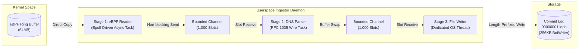

# Cilium Mini: Userspace Architecture & Pipeline

The userspace daemon of `cilium-mini-rs` processes raw DNS events emitted by the kernel eBPF ring buffer, parses RFC 1035 wire packets without dynamic heap allocations, and persists records to a length-delimited Protocol Buffers (`.ldpb`) commit log on disk.

---

## Pipeline Architecture



---

## Pipeline Stages

The ingestion system consists of three decoupled stages:

### Stage 1: Reactive eBPF Reader

- **Epoll Event Loop**: Integrates the ring buffer file descriptor into the async reactor, waking reactively on readability without busy-polling.
- **Direct Copying**: Validates raw event size and moves the payload directly into pre-allocated channel slots.
- **Drop-on-Full Backpressure**: Dispatches to a bounded 1,000-slot queue. If downstream processing lags, incoming packets are dropped non-blockingly to keep the kernel ring buffer drained and preserve reader throughput.

### Stage 2: Zero-Allocation DNS Parser

- **Buffer Reuse**: Maintains a pre-allocated protobuf message buffer, clearing its fields between packets to preserve internal capacity and eliminate heap allocation churn.
- **Wire Parsing**:
  - Validates the 12-byte DNS header (Transaction ID, flags, and record counts).
  - Traverses variable-length length-prefixed domain labels (QNAME), enforcing RFC 1035 limits on label length ($\le 63$) and domain length ($\le 255$).
  - Decodes Answer section resource records, handling RFC 1035 compression pointers (0xC0 prefix) and extracting resolved IPv4 and IPv6 addresses while skipping CNAME records.
- **Zero-Copy Handover**: Swaps the populated buffer into the downstream queue, passing ownership without memory duplication.

### Stage 3: Commit Log Writer

- **Thread Isolation**: Executes on a dedicated OS thread to decouple synchronous file writes from the async task runtime.
- **Buffered Append**: Consumes parsed messages from a 1,000-slot blocking channel, encodes them to Protobuf via a reusable serialization buffer, and batches disk writes through a 256 KB writer.

---

## Storage Framing: Length-Delimited Protobuf (LDPB)

```
+------------------+-----------------------+------------------+-----------------------+
| u32 Length (N)   | Protobuf Data Block   | u32 Length (M)   | Protobuf Data Block   |
|  (4 bytes, BE)   |       (N bytes)       |  (4 bytes, BE)   |       (M bytes)       |
+------------------+-----------------------+------------------+-----------------------+
```

- **Framing**: Each entry is prefixed by a 4-byte big-endian unsigned integer indicating the byte length of the serialized message.
- **Append-Only Mode**: Files are opened exclusively in append mode (`00000001.ldpb`) for sequential disk writes.
- **Page Cache Reliance**: Writes pass through the OS page cache without synchronous flushes, maximizing write throughput during sustained ingestion.
