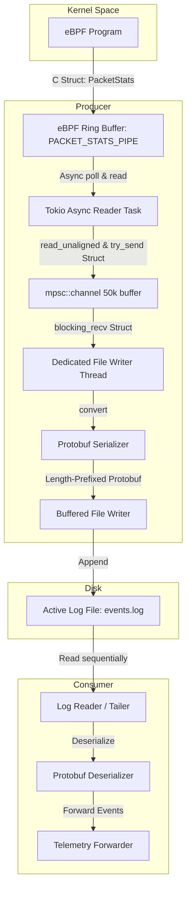

# User-Space Architecture: Write-Ahead Commit Log MVP

This document describes the design and architecture of the user-space component of `packet-watcher-rs`. 

The user-space system is split into two logical pipelines decoupled by an append-only commit log file on disk. This design is inspired by write-ahead logging (WAL) and message brokers like Apache Kafka.

---

## Architectural Diagram



---

## 1. Ingestor Daemon (Producer)

The Ingestor's sole responsibility is to drain the eBPF ring buffer as fast as possible and commit events to disk. By minimizing CPU operations and I/O latency, it guarantees the kernel eBPF ring buffer does not overflow.

### Key Operations
1. **Asynchronous Ring Buffer Polling & Zero-Allocation**: A Tokio async task reads raw byte slices from the `PACKET_STATS_PIPE` using an asynchronous file descriptor (`AsyncFd`). To avoid slow heap allocations (`malloc`), it immediately and safely transforms these unaligned chunks into `PacketStats` structs on the stack using `std::ptr::read_unaligned`.
2. **Buffering**: These stack-allocated structs are sent into a high-capacity multi-producer single-consumer (`mpsc`) channel. Because the channel buffer is pre-allocated on startup, sending the fixed-size struct over the channel requires zero new heap allocations, maximizing packet processing speed.
3. **Dedicated I/O Thread**: A dedicated OS thread consumes the `mpsc` channel. This decoupling prevents slow disk I/O and Protobuf serialization from blocking the fast async eBPF reader.
4. **Translate & Serialize**: Converts the safely read memory representation of the C struct into a Protobuf message, and serializes it to a pre-allocated, reusable byte array to minimize heap allocations.
5. **Length-Prefixed Format & Buffered Writing**: Prepends the size of the serialized message as a Big-Endian `u32` value (Length-Delimited format). It uses a large `BufWriter` (e.g., 256KB) to batch these user-space writes before committing them to disk via system calls, drastically reducing I/O overhead.

---

## 2. Storage Format (Commit Log)

The log file is structured as a sequential stream of length-prefixed binary messages. This format enables high-performance writes and simple, boundary-safe parsing.

```
+------------------+-----------------------+------------------+-----------------------+
|  u32 Length (N)  |  Protobuf Data Block  |  u32 Length (M)  |  Protobuf Data Block  |
|  (4 bytes, BE)   |       (N bytes)       |  (4 bytes, BE)   |       (M bytes)       |
+------------------+-----------------------+------------------+-----------------------+
```

### Technical Details
* **Framing**: Each record starts with a 4-byte big-endian unsigned integer (`u32`) specifying the size of the following Protobuf message. Big-endian (network byte order) is standard for serialization binary formats.
* **Append-Only**: The log file is opened with write-append flags (`O_WRONLY | O_APPEND | O_CREAT`). The storage layer never rewrites or updates existing data.
* **Page Cache Reliance**: The Ingestor calls standard write APIs without `fsync` or `O_SYNC`. The OS caches write operations in memory (the Page Cache) and periodically flushes them to disk asynchronously. This ensures that disk latency does not block packet monitoring.

---

## 3. Forwarder Daemon (Consumer)

The Forwarder runs independently. It reads the commit log, deserializes the Protobuf payloads, and sends the telemetry data to external targets (e.g., standard output, Prometheus, or a remote API).

### Key Operations
1. **Sequential Scan**: Reads from the active log file starting from byte offset `0` (or a saved offset).
2. **Framing Parser**:
   * Reads exactly `4` bytes to parse the payload size $N$.
   * Reads exactly $N$ bytes to fetch the serialized Protobuf message.
3. **Tailing Behavior**:
   * If the Forwarder encounters an EOF (End of File) because it caught up to the Ingestor, it enters a polling phase.
   * It uses a short sleep interval or file change notifications (e.g., `inotify`) to wait for more data to be appended before resuming the read.

---

## 4. MVP Scope and Future Roadmap

This architecture is optimized for initial simplicity and high performance (MVP) while leaving room for production refinement.

### MVP Limitations
* **Single Log File**: The ingestor writes to a single file (e.g., `events.log`). File rotation is omitted from the MVP.
* **In-Memory Offset**: The forwarder keeps its read position in memory. If restarted, it will replay the log from the beginning.

### Planned Extensions
* **Log Segmentation & Rotation**: Closing the active segment and starting a new one when file size exceeds a threshold (e.g., 50MB).
* **Retention Policy**: Automatically deleting old, inactive segments to avoid running out of disk space.
* **Offset Checkpointing**: Periodically persisting the consumer's read byte offset to a state file on disk (e.g., `forwarder.offset`) to survive restarts.
* **Parallel Serialization**: Protobuf encoding is a CPU-intensive path. To improve throughput under extreme load, the pipeline could use a thread pool to distribute the serialization workload across `N` threads. These threads would encode the packets in parallel and then send the serialized byte arrays into a single `mpsc` channel connected to the dedicated file writer thread, effectively parallelizing CPU-heavy work while keeping disk I/O strictly sequential.
